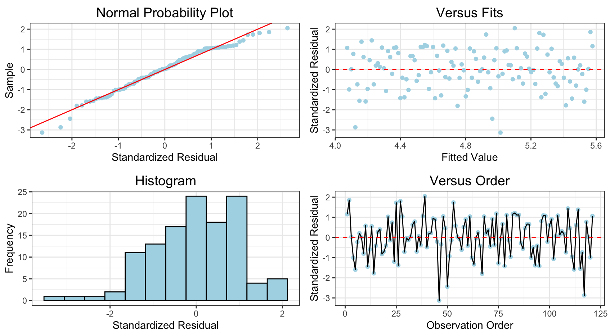

# Create a four in one plot in R


## Installing from GitHub:

```r
# install.packages("devtools")
devtools::install_github('Solita-Jakob/fourinone')
```

In case you miss the package devtools, you call install it by removing the comment (#) and then run install.packages("devtools"). This is what it looks like.

```r
library(fourinone)

## Example 1
df<-data.frame(year = seq(1900,2020,1), value = rnorm(121, 5, 2.5))
four_in_one(lm(value~year,data = df)) # Input is a model
```



```r
## Example 2 - creating x^2 sample data
sample_data<-100
for(i in -10:10){
  sample_data<-c(rnorm(10,i^2,20), sample_data)
}
df<-data.frame(time=1800:2010, value=sample_data)

four_in_one(lm(value~time,data = df)) # Bad fit

ggplot(df, aes(time,value))+ # Clearly x^2 shape
  geom_point()+
  geom_smooth(method = "lm",se = FALSE)
  
df$time2<-df$time^2 
four_in_one(lm(value~time+time2,data = df)) # Great fit
```

Created by Jakob Johannesson
