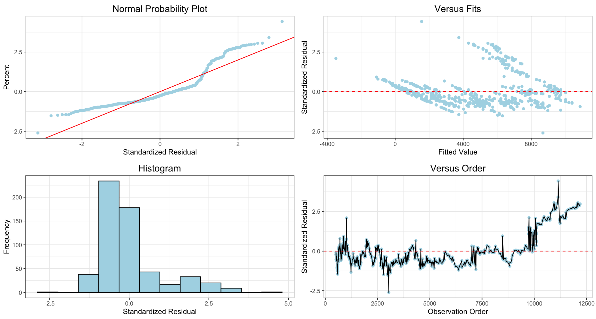

# Create a four in one plot in R


## Installing from GitHub:

```r
# install.packages("devtools")
devtools::install_github('Solita-Jakob/fourinone')
```

In case you miss the package devtools, you call install it by removing the comment (#) and then run install.packages("devtools"). This is what it looks like.

